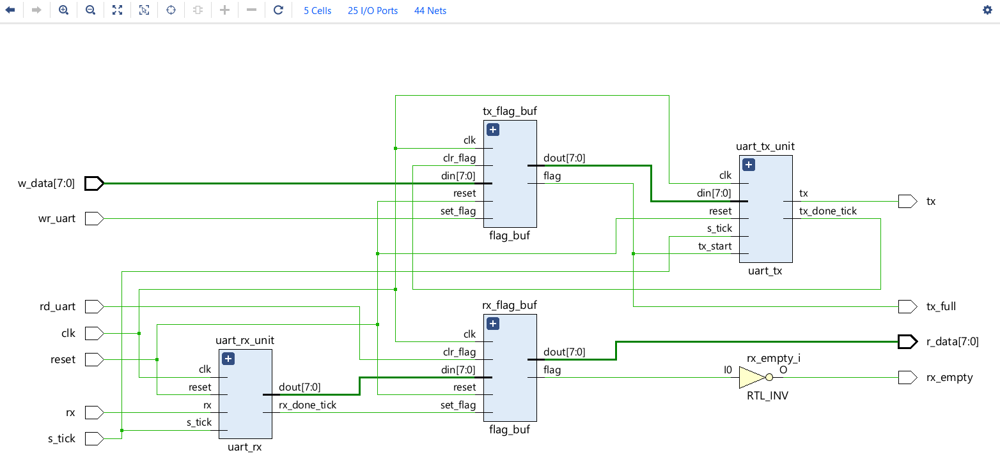

# UART Design in Verilog (Flag + Buffer Based)

This repository contains a Verilog implementation of a UART
(Universal Asynchronous Receiver Transmitter).

## Features
- 8-bit data
- 1 stop bit
- No parity
- Flag + 1-word buffer interface
- Separate RX and TX modules
- Designed following Pong P. Chu's architecture

## Modules
- `uart_rx.v` : UART receiver (oversampling-based)
- `uart_tx.v` : UART transmitter
- `flag_buf.v`: Flag + 1-word buffer interface
- `uart_top.v`: Top-level UART module
- `uart_tb.v` : Testbench

## Interface Scheme
This design uses a flag-based interface (no FIFO).
The system must check `rx_empty` before reading
and `tx_full` before writing.

## Architecture
The UART uses a flag + one-word buffer interface scheme.
The receiver and transmitter are FSM-based, while buffering
and handshaking are handled using flag logic.

## Tools Used
- Verilog HDL
- Xilinx Vivado
- XSim (for simulation)

## Design Details
- Receiver uses 16x oversampling
- FSM-based RX and TX
- Flag-based interface (no FIFO)
- Blocking data overwrite avoided using flag logic

## How to Simulate
1. Open Vivado
2. Add files from `rtl/` and `tb/`
3. Run behavioral simulation

## Author
Aman Sharma
